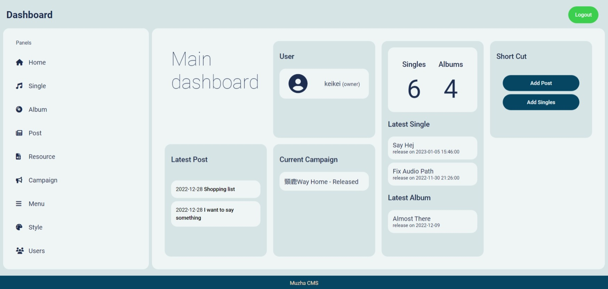

# Muzha - CMS for music

This is a simple CMS cater for music creator

## Table of contents

- [Overview](#overview)
  - [Feature](#feature)
  - [Links](#links)
- [Set up](#set-up)
- [Author](#author)

## Overview

### Feature

- Backend control panels
- Add and manage soundtracks and albums
- Create and manage posts
- Setting campaign
- Upload/update Stylesheet
- Artist information settings
- Menu switches

### Links

- Doc: [On the way](https://github.com/hejkeikei/)
- Demo Site: [On the way](https://hejkeikei.github.io/)

## Set up

- Clone this repository or download entire file
- Place it on desired directory
- Go to **rootFolder/admin/index** 
- Enter database info and create an account
- All set!

### Continued development

- Built in music player
- User privilege settings
- Easier styling option

## Get in touch

- Website - [Lihoworld](https://www.lihoworld.com/)
- Frontend Mentor - [@hejkeikei](https://www.frontendmentor.io/profile/hejkeikei)
- Linkedin - [Ting-Huei Chen](https://www.linkedin.com/in/ting-huei-chen/)
